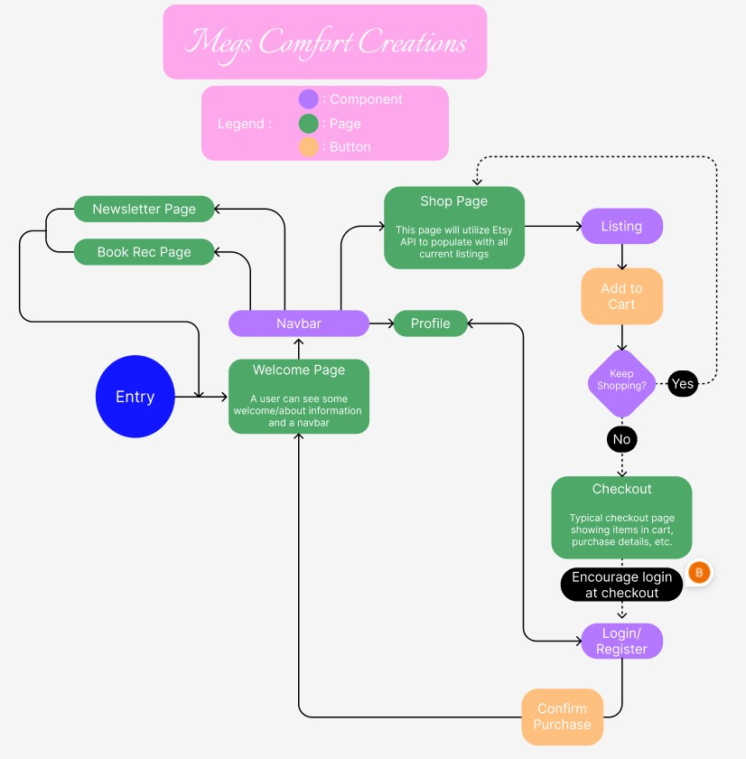
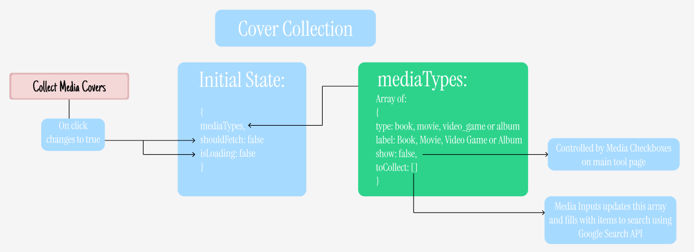
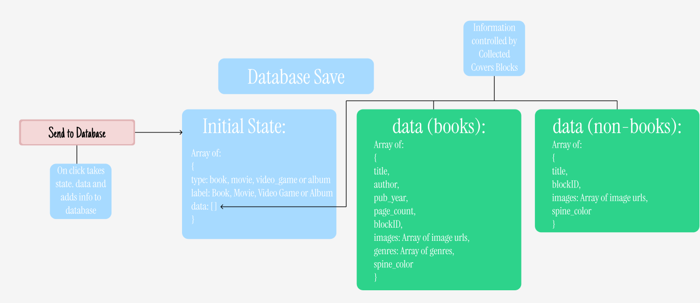
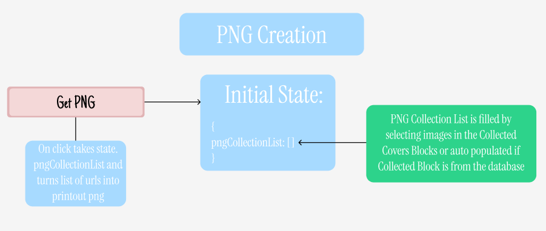

## Flowcharts

# User Flow

As a full website, the user would see this main page flow:

;

# State Management

Within the state of the program there are three main pieces of state:

1. The Cover Collection State
    1. Flow Diagram:
       ;
2. The Database State
    1. Flow Diagram:
       ;
3. The PNG Collection State
    1. Flow Diagram:
       ;
